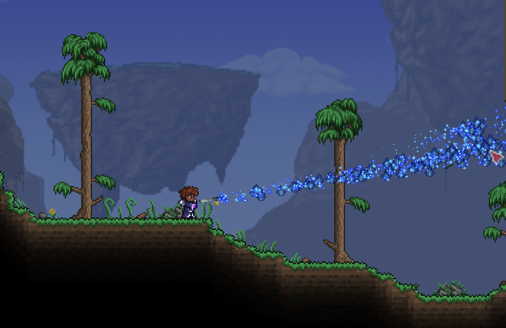

# Sorcerous Applications

A small tModLoader based mod for Terraria, focused on magical tools, gameplay and related items. [SteamWorkshop Link](https://steamcommunity.com/sharedfiles/filedetails/?id=3762477104) 

## Requirements

- [Terraria](https://store.steampowered.com/app/105600/Terraria/) (It's fun, buy it!)
- [tModLoader](https://store.steampowered.com/app/1281930/tModLoader/) (Steam)

## Content (Build 1.0.0)

- **Soul Fragment** — crafting material; drops from Skeletons and Ghosts
- **Foci** — close-range magic thrust weapon
- **Flame Staff** — hold to charge, then short-range cone of fire
- **Force Staff** — hold to charge, then fires a high-knockback orb that pierces tiles and enemies

## Status

Early stage development in this mod, content is minimal and subject to change, balancing and bug fixing.
Looking to improve the integration into the pre hardmode gameplay loop
Mainly focused on items and gameplay elements of interest to myself.

